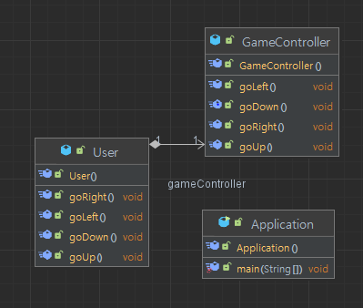

# 🐬프로젝트 소개
- 게임 유저가 다양한 명령어를 통해 유저 위치를 이동시키는 게임
- UP, DOWN, RIGHT, LEFT 네가지 명령어로 유저 위치를 상하좌우 이동.
- EAT 명령어를 이용해 음식을 먹고 체력을 충전.
- 게임 종료를 원할 시 BYE 명령어를 사용.
---
# 🐬시스템 요구사항

- 게임 유저는 위로 이동, 아래로 이동, 오른쪽으로 이동, 왼쪽으로 이동할 수 있다.
- 게임기(GameController)는 UP, DOWN, RIGHT, LEFT로 유저의 이동을 조작할 수 있다.
- 게임 유저는 처음에 (0, 0)에 위치하며 hp는 100이다.
- 게임 유저는 이동할 때마다 체력이 5씩 줄어들며 현재 위치와 체력을 항상 출력해준다.
- 게임 유저가 음식을 먹으면 음식 글자 수만큼 체력이 충전된다 ex)치킨을 먹으면 hp +2
- 상하좌우 이동할 시 1칸씩 이동한다. x, y 가 0 미만이면 이동하지 못하고 무시된다.
- 만약 게임 유저의 체력이 0이 되면 체력 충전에 대한 경고문이 뜬다.

---
# 🐬커뮤니케이션 다이어그램
